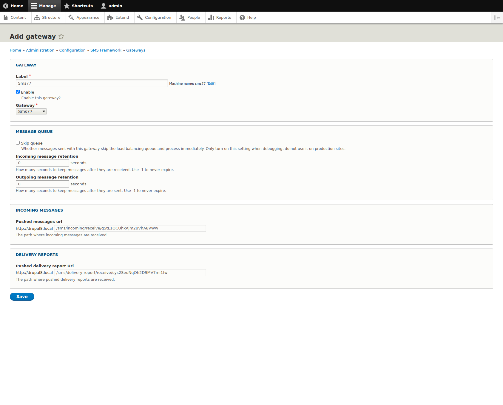
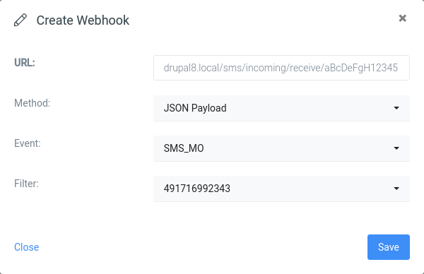

  

<h1 align="center">seven Gateway for Drupal SMS Framework</h1>

  Plug seven into the <a href="https://www.drupal.org/project/smsframework">Drupal SMS Framework</a> as an outbound and inbound SMS gateway.

  
  
  

---

## Features

- **Outbound SMS Gateway** - Standard SMS Framework gateway, drop-in for any module that uses SMS Framework
- **Inbound SMS** - Forward incoming SMS via webhook to create or update Drupal entities
- **Custom Sender ID** - Configure an alphanumeric or numeric sender per gateway

## Prerequisites

- Drupal 9 / 10 / 11
- The [SMS Framework](https://www.drupal.org/project/smsframework) module installed and enabled
- A [seven account](https://www.seven.io/) with API key ([How to get your API key](https://help.seven.io/en/developer/where-do-i-find-my-api-key))

## Installation

1. Extract the [latest release](https://github.com/seven-io/drupal-sms-framework/releases/latest) into `/path/to/drupal/web/modules`.
2. In the Drupal admin go to **Extend > SEVEN SMS**, tick *seven SMS Module* and click **Install**.
3. Open **Configuration > SMS FRAMEWORK > Gateways** and click **+ Add gateway**.
4. Configure the seven gateway as shown:

   

5. Paste your API key and (optionally) a sender ID, then save.

## Inbound SMS (optional)

To receive inbound SMS as Drupal events:

1. In the seven [dashboard](https://app.seven.io/) under *Developer > Webhooks* add an inbound-SMS webhook.
2. Point the webhook URL at `/<your-drupal>/sms/receive/seven`:

   

Drupal events fire on every incoming message and can be consumed by Rules, Webform handlers, or any custom module.

## Support

Need help? Feel free to [contact us](https://www.seven.io/en/company/contact/) or [open an issue](https://github.com/seven-io/drupal-sms-framework/issues).

## License

[MIT](LICENSE.txt)
